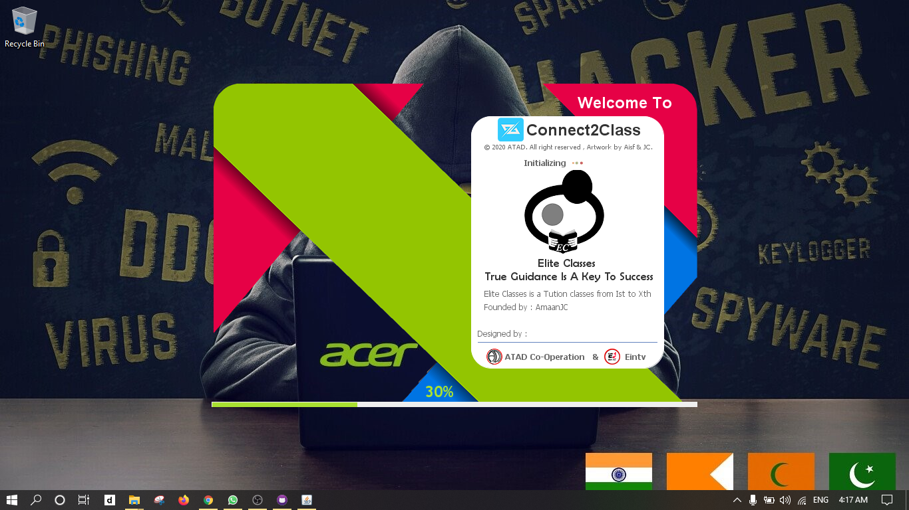

# Classes-Management-System(DESKTOP APPLICATION USING JAVA NETBEANS 8.2 and MySQl 8.0.21,MySQL WORKBENCH 8.0)
## Developers Name : AMAAN DIWAN

***This Software is SEM V-Project Of Third Year BscCS student which is developed by Students of Bhavans College,Mumbai,India in the year 2020-2021***

## Important NOTE
**First You need to add all jar file to netbeans libaray classes-management-system/jar TO LIBRARY BEFORE RUNNING JAVA NETBEANS.IF YOU WILL NOT ADD THIS YOU FACE ERRORS**

## SPLASHSCREEN

## SIGN IN PANE

## SIGN UP PANE

## Forget Password PANE

## DASHBOARD PANE

## STUDENT PANE

## UPDATE STUDENT PANE

## TEACHER PANE

## UPDATE TEACHER PANE

## SUBJECT PANE

## UPDATE SUBJECT PANE

## REPORT PANE

## FEES PANE

## GENERATE RECEIPT PANE

## FEE RECEIPT PDF

## REPORT EXCEL SHEET

## DATABASE FOR USERNAME AND PASSWORD
USERNAME : amaan 
PASSWORD : root
